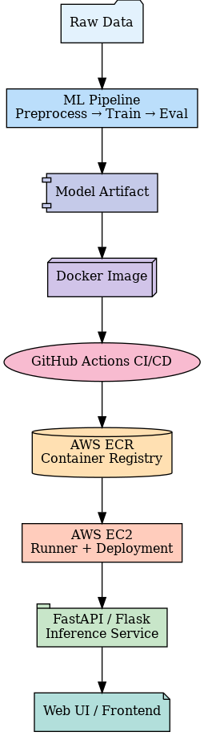

### End-to-End Deep Learning Project (Production-Ready, MLOps + CI/CD + AWS)

#### Data Link: 

## Workflows

1. Update config.yaml
3. Update params.yaml
4. Update the entity
5. Update the configuration manager in src config
6. Update the components
7. Update the pipeline 
8. Update the main.py
9. Update the app.py

End-to-End Deep Learning Project (Production-Ready, MLOps + CI/CD + AWS)

A complete deep learning pipeline built with modular ML architecture, CI/CD automation, containerization, and cloud deployment.
Designed to demonstrate real-world ML engineering skills used in healthcare + biomedical AI.

### Project Overview

This project implements a full end-to-end deep learning system, including:

Data ingestion pipeline (config-driven)

Training + Evaluation pipeline (CNN-based classifier)

Prediction service with a web UI (FastAPI/Flask)

CI/CD automation with GitHub Actions

Dockerized deployment to AWS (ECR + EC2)

Production workflow following ML engineering best practices

This repository demonstrates the ability to build scalable, reproducible ML systems used in clinical AI, medical imaging, pharma research, and production MLOps workflows.
## 📌 System Architecture (Enterprise-Grade)

### Project Architecture

data/
config/
src/
   ├── components/
   ├── config/
   ├── cnnClassifier/
   ├── pipeline/
   └── utils/
templates/
.github/workflows/
app.py
main.py
Dockerfile
requirements.txt
params.yaml
config.yaml

### Key Features
✔ Modular ML pipeline (train → evaluate → predict)
✔ Config-driven architecture (YAML-managed)
✔ Automated CI/CD pipeline (GitHub Actions)
✔ Full Docker containerization
✔ AWS deployment with EC2 + ECR
✔ Interactive prediction web app
✔ Production-ready folder structure
✔ Automatic training logs + JSON-based score tracking

### Tech Stack

Python, PyTorch / TensorFlow

FastAPI / Flask (inference server)

Docker, GitHub Actions

AWS EC2, ECR, IAM

YAML-based configuration management

# How to Run the Project
#1. Clone the Repository
git clone https://github.com/sohel10/End-to-End-Deep-Learning-Project
cd End-to-End-Deep-Learning-Project

# 2. Create Conda Environment

conda create -n chi python=3.8 -y
conda activate chi

# 3. Install Requirements
pip install -r requirements.txt

#  4. Update AWS Credentials (For Deployment)
export AWS_ACCESS_KEY_ID="YOUR_KEY"
export AWS_SECRET_ACCESS_KEY="YOUR_SECRET"
export AWS_REGION="us-east-1"

# 5. Run the Application
python app.py

# AWS CI/CD Deployment Pipeline

This project includes a production-ready MLOps deployment workflow.

# Step 1 — Create IAM User

With permissions:

AmazonEC2FullAccess

AmazonEC2ContainerRegistryFullAccess
# Step 2 — Create ECR Repository

# Step 3 — Create EC2 Instance

Ubuntu + Docker installed:

sudo apt-get update -y
curl -fsSL https://get.docker.com -o get-docker.sh
sudo sh get-docker.sh
sudo usermod -aG docker ubuntu

# Step 4 — Configure EC2 as Self-Hosted GitHub Runner

GitHub → Repo → Settings → Actions → Runners

Follow the instructions and run commands on EC2.

# Step 5 — Add GitHub Secrets
AWS_ACCESS_KEY_ID=
AWS_SECRET_ACCESS_KEY=
AWS_REGION=us-east-1
AWS_ECR_LOGIN_URI=40492535.dkr.ecr.us-east-1.amazonaws.com
ECR_REPOSITORY_NAME=chicken

# Step 6 — GitHub Actions Will Automatically:

Build Docker image

Push to ECR

SSH to EC2 runner

Pull latest image

Start container

Run prediction service

### 📊 Training & Evaluation

Model metrics are automatically saved to:

scores.json

Artifacts (models, logs, metrics) stored in:

model/

### 🎯 Use Cases

This project can be extended to:

Medical image classification

ADMET prediction

Clinical risk scoring

Pathology image analysis

Automated cloud‐ready ML workflows

### 📎 License

MIT License.

